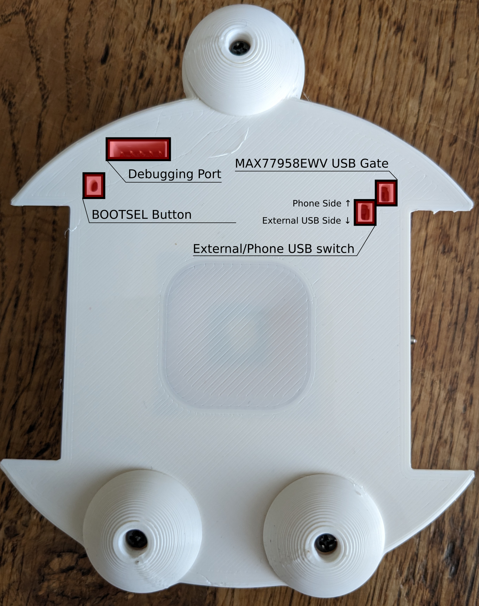
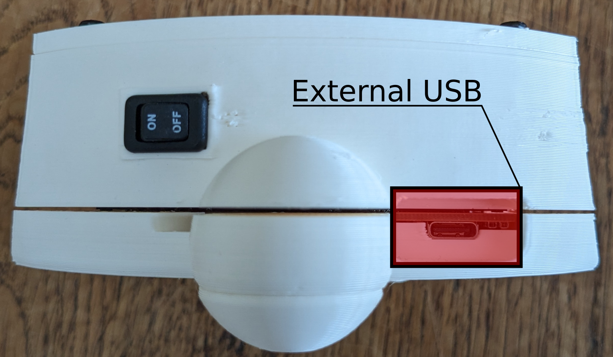
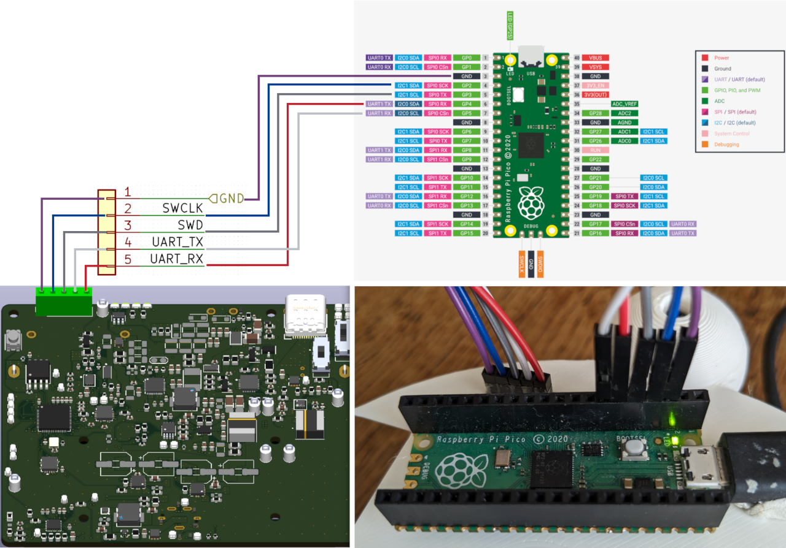

This repo hosts the firmware used by the [rp2040](https://www.raspberrypi.com/documentation/microcontrollers/rp2040.html#software-development) powered [PCB](https://github.com/oist/smartphone-robot-cad/tree/pcb) for the OIST smartphone robot project.

# Updating firmware

1. Download the most recent firmware release [robot.uf2](https://github.com/oist/smartphone-robot-firmware/releases/latest)
2. Take a small screwdriver and flip the External/Phone USB switch toward External USB Side (See image below)
3. Use the screwdriver to push and hold the BOOTSEL Button
4. Attach a USB cable between the external USB port and your PC.
5. Release the BOOTSEL Button. You should now see the board appear as an external USB device.
6. Drag and drop robot.uf2 to this external USB device. The device will automatically restart and disconnect from your PC. The new firmware should now be running.
7. Return the External/Phone USB switch to Phone USB Side.

## Toggle Switch Legend:
| External Phone/USB Switch | MAX77958EWV USB Gate | State                                                                                                                                       |
|----------------------------|----------------------|--------------------------------------------------------------------------------------------------------------------------------------------|
| UP                         | UP                   | RP2040 D+/- lines disconnected from everything (i.e. nothing will work)                                                                    |
| DOWN                       | DOWN                 | RP2040 D+/- lines connected to external USB, phone-side USB lines connected to MAX77958, but not connected to RP2040                        |
| UP                         | DOWN                 | RP2040 D+/- lines connected to phone-side USB                                                                                              |
| DOWN                       | UP                   | RP2040 D+/- lines connected to external USB, phone-side USB lines bypass MAX77958 by shorting USB lines with MAX77958 DN1 and DP2 pins, not sure if this is harmful or even useful ever |



# Building, Flashing, and Debugging Firmware via Debugging Port



The above wiring diagram assumes you have the debugprobe firmware running on your Raspberry Pi Pico. See [here](https://www.raspberrypi.com/documentation/microcontrollers/pico-series.html#debugging-using-another-pico-series-device) for documenation on how to do this.

The recommended way to build, flash, and debug the firmware is by using the provided Docker image and Makefile. All dependencies are managed via Docker for a reproducible and easy workflow.

## Pulling the Docker Image
First, pull the Docker image:
```bash
docker pull topher217/smartphone-robot-firmware:latest
```

## Building the Firmware
Build the firmware using the Makefile (from the `firmware` directory):
```bash
make firmware
```

## Flashing the Firmware
Flash the firmware to the device:
```bash
make flash
```

## Debugging the Firmware
Debugging is a two-step process:

1. **Start OpenOCD in one terminal:**
    ```bash
    make openocd
    ```
    This will start OpenOCD in a Docker container and show its output. Leave this terminal open.

2. **Start GDB in a second terminal:**
    ```bash
    make debug
    ```
    This will connect GDB to the running OpenOCD server in the same container.

- To stop OpenOCD, simply press `Ctrl+C` in the terminal where you ran `make openocd`.
- If you ever need to forcibly clean up the debug container (e.g., after an unexpected exit), run:
    ```bash
    make docker-clean
    ```

## Interactive Shell
To open an interactive shell in the Docker environment:
```bash
make shell
```

# Editing Firmware

The firmware source is in the `src/` directory. Header files are in `include/`.

After making changes, rebuild the firmware using:
```bash
make firmware
```

# Updating the Docker Image

If you need to update or change the Docker image, run the following command from the `docker` directory:
```bash
cd docker && docker build -t topher217/smartphone-robot-firmware:latest .
```

All Docker files are located in the `docker/` directory.
